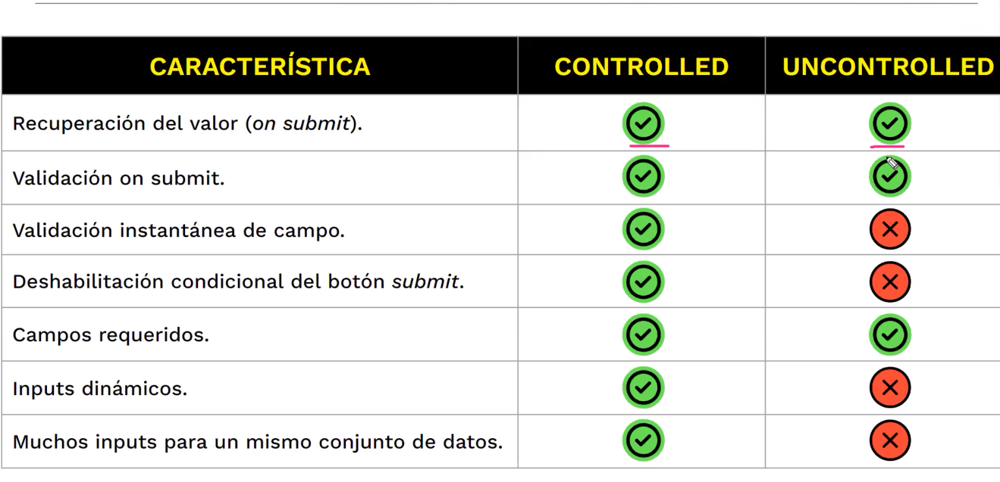

# 1 Formularios 
Los formularios son una de las partes más importantes de cualquier aplicación web. En este capítulo vamos a ver cómo crear formularios en React, y cómo manejar los datos que se introducen en los formularios.

# 2 Manejo de formularios
Existen dos maneras básicas de manejar formularios en React:
    * Formularios controlados
    * Formularios no controlados

Se deberá crear un estado por cada propiedad del formulario para poder controlar los cambios en los campos del formulario. Para ello, se deberá crear un evento onChange para cada campo del formulario, que actualice el estado del campo correspondiente.

## Formularios controlados
Los formularios controlados (también conocidos como formularios controlados por estado) son una técnica utilizada en el desarrollo de aplicaciones web para manejar el estado de los elementos de formulario de manera explícita. 
Cuando un usuario interactúa con un elemento de formulario controlado, su estado interno se actualiza de forma explícita, lo que a su vez actualiza la vista del formulario en la pantalla. Esto permite que el desarrollador tenga un mayor control sobre el comportamiento del formulario y evita problemas comunes asociados con los formularios no controlados, como la falta de sincronización entre los datos del formulario y el estado interno de la aplicación.

## Formularios no controlados
En un formulario no controlado, los elementos de formulario (como un campo de texto o una casilla de verificación) son representados por el navegador web. El estado de estos elementos es manejado por el propio navegador y no por el desarrollador de la aplicación. Esto significa que cuando un usuario interactúa con un elemento de formulario no controlado, el estado del elemento se actualiza en el navegador, pero no en el estado interno de la aplicación.

